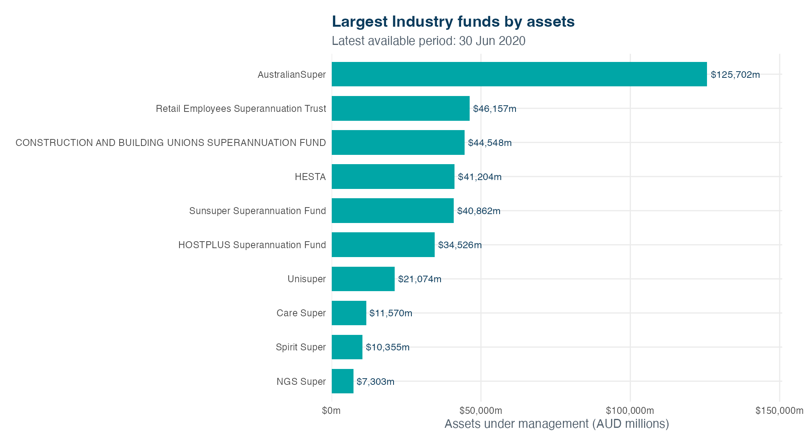
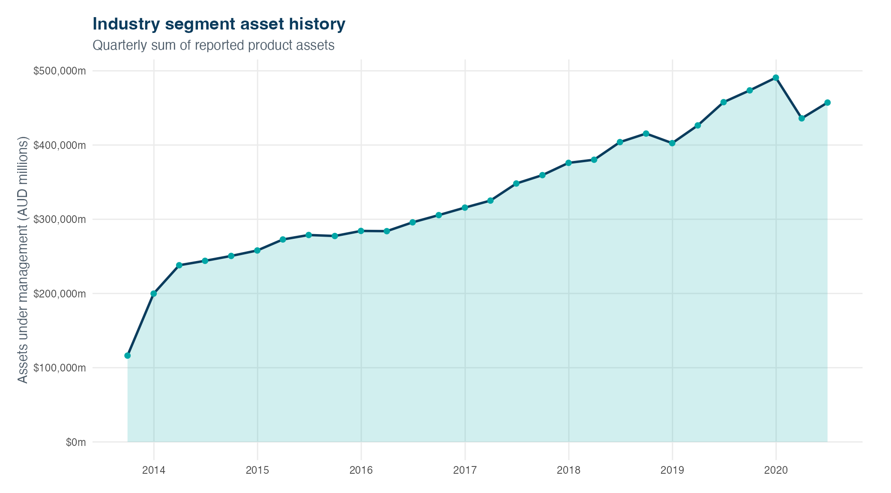
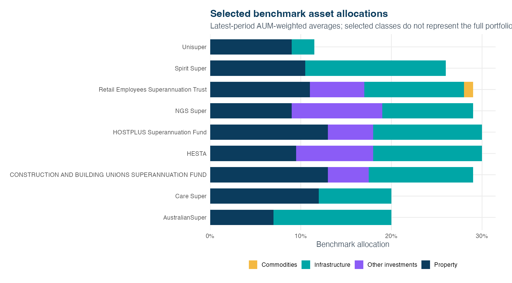
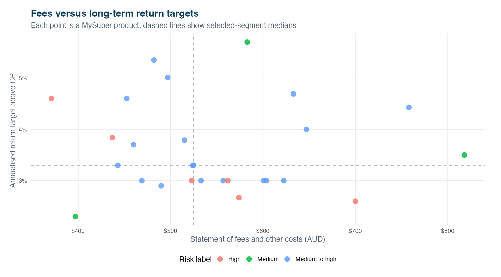

# Australian Superannuation Fund Performance Analytics

Interactive R Shiny analytics for exploring historical Australian MySuper fund scale, asset growth, benchmark allocation, fees and long-term return targets.

[](https://www.r-project.org/)
[](https://shiny.posit.co/)
[](data/README.md)
[](docs/methodology.md)
[](LICENSE)

**[Launch the live dashboard](https://poojadhandhi.shinyapps.io/poojafinal/)** · **[View the app code](app.R)** · **[Explore the data](data/)** · **[Read the methodology](docs/methodology.md)** · **[Deployment guide](docs/deployment.md)**

[](https://poojadhandhi.shinyapps.io/poojafinal/)

> **Portfolio message:** I can turn real financial-sector data into an interactive, decision-focused analytical product and communicate the limits of the evidence clearly.

## Project snapshot

| | |
|---|---|
| **Business need** | Compare market scale, historical asset movement, portfolio targets and disclosed fees across MySuper segments. |
| **Primary users** | Analytics teams, fund strategy teams and stakeholders exploring historical sector patterns. |
| **Deliverable** | A filterable R Shiny dashboard with four analytical views and downloadable data. |
| **Data grain** | MySuper product by quarterly reporting period. |
| **Coverage** | Historical data from 2013 to 30 June 2020. |
| **Outcome** | A reproducible portfolio project with corrected metrics, documented assumptions and decision-ready visuals. |

## Key findings from the default Industry view

- **AustralianSuper led on scale:** AUM was **AUD 125.7 billion** at 30 June 2020, approximately **27.5%** of the Industry segment represented in the dataset.
- **Reported segment assets expanded:** total Industry product assets rose from **AUD 116.3 billion** in the first available quarter to **AUD 457.2 billion** at 30 June 2020, a **293.2%** increase. This descriptive change may also reflect product and reporting-coverage changes.
- **Fees and targets varied:** among 27 Industry products with both fields available, the median disclosed fee was **AUD 525** and the median ten-year return target was **3.3 percentage points above CPI**.

These are historical descriptive findings, not current fund rankings or investment recommendations.

## Dashboard walkthrough

### 1. Market scale

Ranks funds by total assets at the **latest reporting date** for the selected segment. Product-level assets are aggregated within fund and period; they are not summed across time.

[Open full-size chart](screenshots/top-10-funds.png)

### 2. Asset growth

Tracks the quarterly sum of reported product assets and exposes expansion, contraction and discontinuities that warrant deeper investigation.

<details>
<summary><strong>Show asset-growth view</strong></summary>



</details>

### 3. Benchmark allocation

Compares four selected asset classes using **AUM-weighted benchmark allocations** in the latest period. The selected classes are only part of each portfolio, so the stack is not intended to equal 100%.

<details>
<summary><strong>Show allocation view</strong></summary>



</details>

### 4. Fees and return targets

Positions each product by disclosed fees and its annualised ten-year return target above CPI. Median reference lines support relative comparison without implying that targets are realised returns.

<details>
<summary><strong>Show fee-target view</strong></summary>



</details>

## Business questions answered

1. Which funds have the largest latest-period AUM within each fund type?
2. How did reported segment assets change through time?
3. How do selected benchmark allocations differ across major funds?
4. Where do products sit relative to segment-median fees and long-term targets?
5. Which patterns require further investigation rather than an immediate conclusion?

## Analytical workflow

```text
Public MySuper data
        ↓
Clean dates, numeric fields and empty source rows
        ↓
Apply fund-type filter and latest-period logic
        ↓
Aggregate AUM and calculate weighted benchmark allocations
        ↓
Generate interactive charts and dynamic decision insights
        ↓
Document assumptions, limitations and reproducibility
```

## Why this version is analytically stronger

The portfolio implementation corrects three issues in the initial prototype:

- **Fund size is measured at the latest date.** Adding AUM across quarters counts the same assets repeatedly and overstates scale.
- **Allocation uses benchmark percentages.** Upper range limits from several periods are not portfolio weights and should not be stacked together.
- **The unsupported risk-adjusted-return label is removed.** A defensible risk-adjusted measure requires a consistent realised-return series and a defined volatility measure. This dashboard instead compares fees with clearly labelled long-term targets.

See [the full methodology](docs/methodology.md) for metric definitions and limitations.

## Repository navigation

| Path | Purpose |
|---|---|
| [`app.R`](app.R) | Self-contained Shiny application and analytical logic |
| [`australian-superannuation-fund-analytics.Rproj`](australian-superannuation-fund-analytics.Rproj) | Ready-to-open RStudio project |
| [`data/`](data/) | Cleaned CSV, schema, source attribution and data-quality notes |
| [`docs/methodology.md`](docs/methodology.md) | Metric definitions, corrections and limitations |
| [`docs/deployment.md`](docs/deployment.md) | Local, shinyapps.io and GitHub publishing steps |
| [`screenshots/`](screenshots/) | README-ready dashboard visuals |
| [`scripts/generate_screenshots.R`](scripts/generate_screenshots.R) | Reproducible chart export script |

## Run locally

```r
install.packages(c(
  "shiny", "ggplot2", "dplyr", "tidyr",
  "readr", "scales", "bslib"
))

shiny::runApp()
```

The application expects [`data/mysuper_data.csv`](data/mysuper_data.csv) to remain in its current relative location.

## Tools and skills demonstrated

- R, Shiny and Bootstrap theming
- Data cleaning with `readr`, `dplyr` and `tidyr`
- Financial-sector exploratory analysis
- Period-aware aggregation and AUM-weighted calculations
- Interactive filtering and downloadable extracts
- `ggplot2` data visualisation
- KPI design and stakeholder-focused communication
- Data-quality, methodology and limitation documentation

## Data source and licence

The project uses [Superannuation MySuper Performance 2013-2020](https://www.kaggle.com/datasets/darylb/superannuation-mysuper-product-by-product-2013-20). The publisher states that the data was sourced from APRA and is licensed under the [Creative Commons Attribution 3.0 Australia Licence](https://creativecommons.org/licenses/by/3.0/au/).

The source data is historical and does not imply APRA endorsement. Project code is available under the [MIT License](LICENSE); the dataset retains its source licence.

## Disclaimer

This project is for analytical, educational and portfolio purposes. It is not financial advice, and long-term return targets must not be interpreted as realised returns or forecasts.
